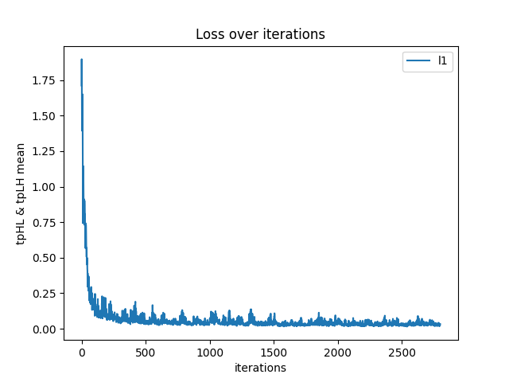
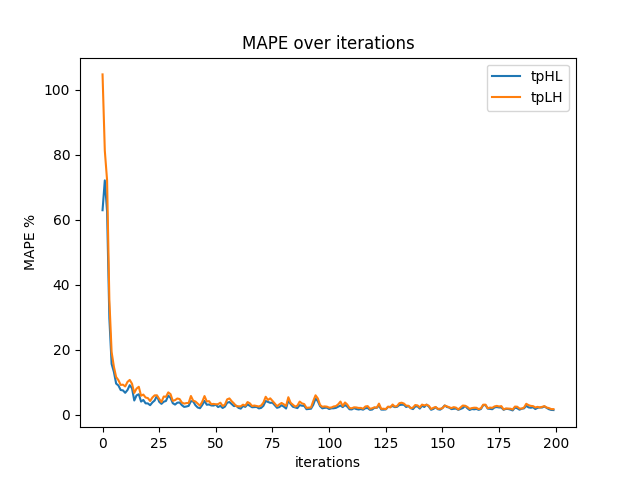

## SPICE Simulation

1. Ensure there is **hspice** in the current environment.
2. Put the sub-circuit definition to `./Spice/Cirs/models/XXX.cir`.
3. Change the parameters (input transition time, load capacitance) in `./Spice/Cirs/generated/generate_hspice.py`.
4. run `python ./Spice/Cirs/main.py`.

*PS: You can run `python ./Spice/Tools/delete_files.py` to delete complex process files.*

## Neural ODE

This repo refers to https://github.com/EmilienDupont/augmented-neural-odes.

* The Dataset for Neural ODE model is saved in `./Spice/Libs/Ours/Dataset`.
* run `python ./NODE/main.py`.

## Results

Training L1-loss: **0.028**

MAPE Training Error: **1.1586%** (tpHL), **1.3858%** (tpLH) 

MAPE Test Error: **1.0692%** (tpHL), **1.3246%** (tpLH)

MAPE (Voltage Extrapolation): **1.3388%** (tpHL), **1.6663%** (tpLH)

